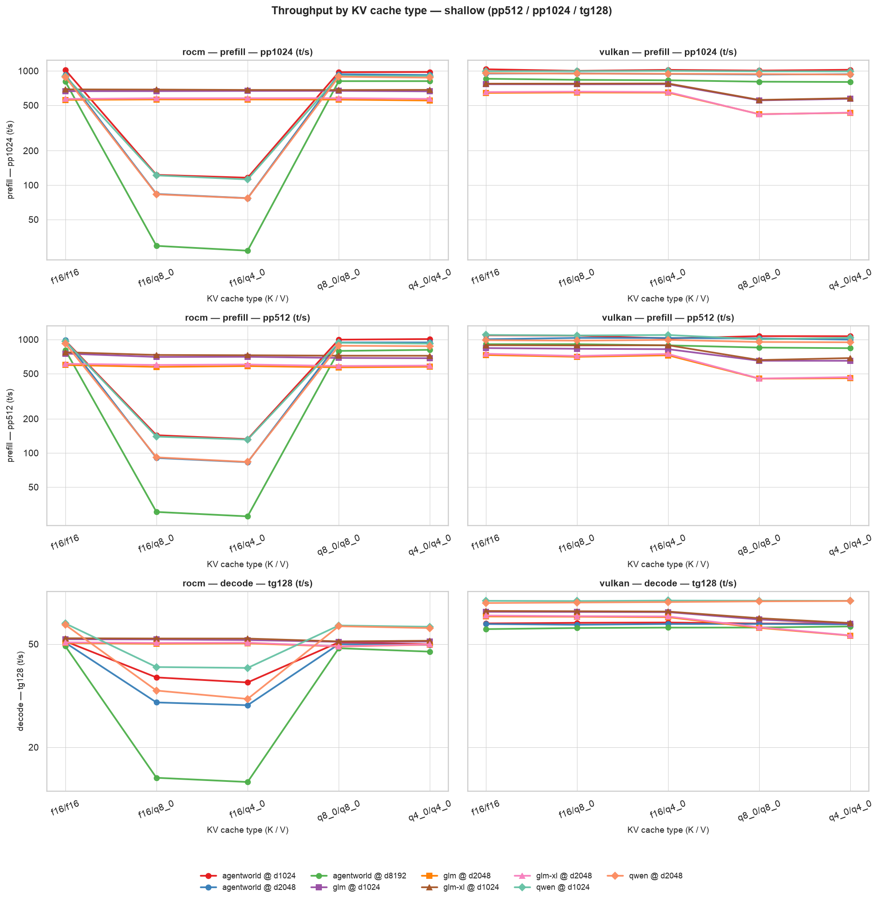
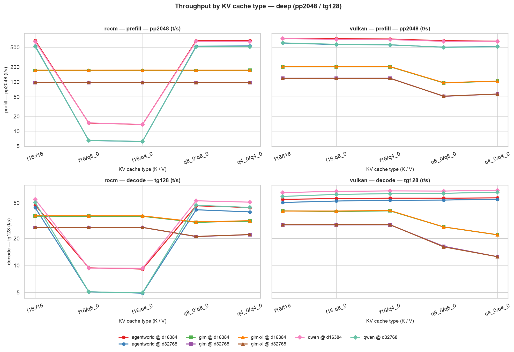
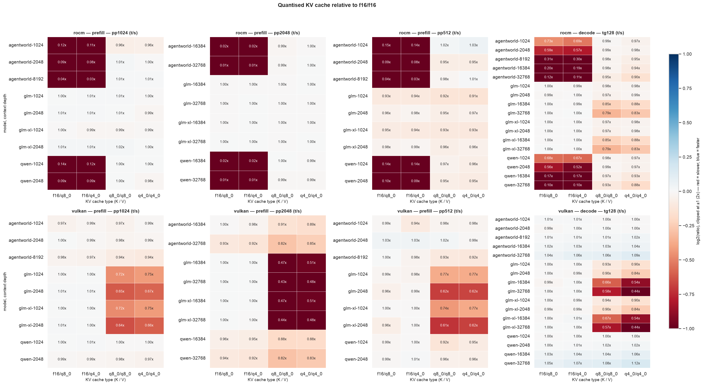
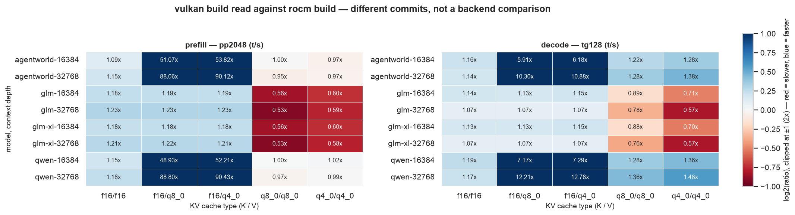
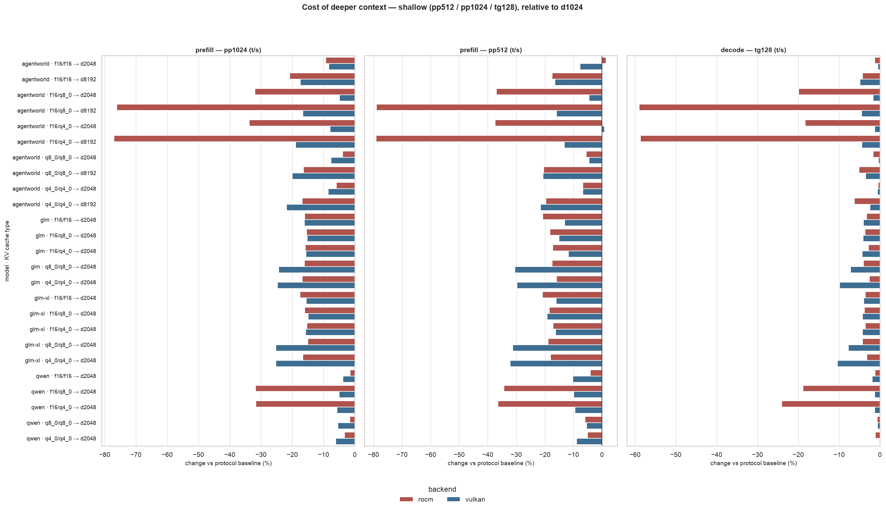
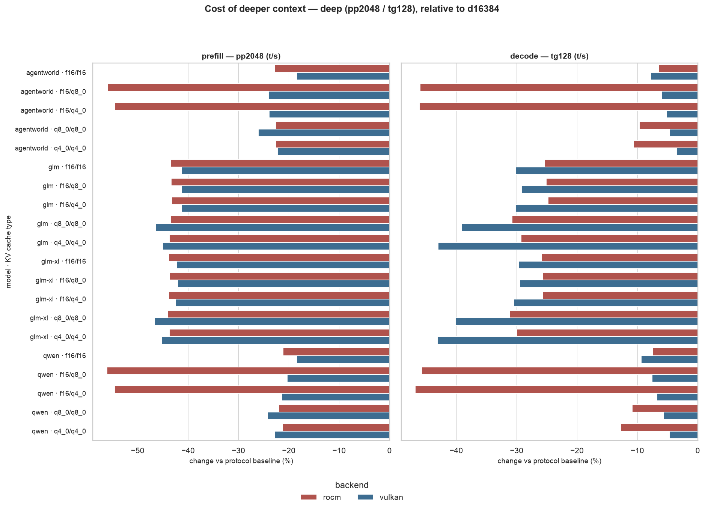

# Mikke Zavala :: KV cache and context depth on a gfx1151 iGPU

> [!TIP]
> Visit the Interactive Dashboard: [https://mikkezavala.github.io/llm-bench/](https://mikkezavala.github.io/llm-bench/notebook.html)

Throughput measurements for four models people run locally for coding, on an **AMD Ryzen
AI MAX+ 395 w/ Radeon 8060S** (gfx1151, 128 GB unified memory), across five KV cache type
pairs and five context depths, recorded under both the ROCm and the Vulkan build of
`llama.cpp`.

**What this is.** A record of how throughput responds to *configuration* on one machine: which
KV cache type, how deep the context, and which model is loaded. If you have similar hardware,
these are the numbers I got and the settings that produced them.

**What this is not.** A comparison of ROCm against Vulkan. The two builds are different
`llama.cpp` commits made days apart, so any difference between them contains the backend *and*
everything else that changed between those commits. Results are reported per backend and
compared within a backend. No number here is offered as "backend X is faster than backend Y",
and none should be quoted that way.

> **Status: ongoing.** Runs are still being added and more factors are yet to be swept —
> `use_mmap` next, and the other runtime knobs are constant for now. Numbers move as the
> dataset grows.
>
> This page reports what the log contains and how much of it is comparable. It does not explain
> *why* any measured difference occurs — attributing one to an attention kernel, a driver path
> or a build difference would need evidence this dataset does not contain. Where a measurement
> has more than one possible explanation, the alternatives are listed as open questions rather
> than resolved.
>
> Every figure and number here is regenerated from `data/results.jsonl` on each build, so the
> write-up and the data cannot silently drift apart.

## Snapshot

| | |
| --- | --- |
| Hardware | `cpu_info`: AMD Ryzen AI MAX+ 395 w/ Radeon 8060S (gfx1151), 128 GB unified memory |
| Builds | `build_commit` `a66d505` / `build_number` 1 for all ROCm records; `d6d899580` / 9747 for all Vulkan records |
| Reported GPU | `Radeon 8060S Graphics` (ROCm), `Radeon 8060S Graphics (RADV STRIX_HALO)` (Vulkan) |
| Tests | 430 `llama-bench` records → 170 configurations, 1 record per (configuration, metric) |
| `test_time` span | 2026-07-31T21:39:58Z to 2026-08-01T04:40:38Z |
| Metrics | prefill `pp512` / `pp1024` / `pp2048` (depends on depth — see below) and decode `tg128`, tokens/second |
| Factors | 4 models × 2 backends × 5 depths × 5 KV pairs — 30 of 200 cells empty (`d8192` is `agentworld` only so far) |
| Held constant | 11 runtime knobs: `flash_attn=1`, `use_mmap=True`, `no_kv_offload=False`, `n_batch=1024`, `n_ubatch=512`, `n_threads=8`, `n_gpu_layers=-1`, `n_cpu_moe=0`, `split_mode=layer`, `poll=50`, `embeddings=False` |
| Repetitions | 1 per test (`samples_ts` has length 1, so `stddev_ts` is 0) |

**Two measurement protocols by depth.** Prefill length is not held constant across the log:

| depths | prefill tests | decode | shape |
| --- | --- | --- | --- |
| 1024, 2048, 8192 | `pp512` and `pp1024` | `tg128` | triplet |
| 16384, 32768 | `pp2048` | `tg128` | pair |

That matters: a prefill ratio that crosses the two groups is not the same test (different
prompt lengths). `tg128` is the decode metric shared by every depth. Paired contrasts only
join configurations that actually share a metric, so the pipeline does not invent a
`pp2048` at `d1024` — but any write-up that pools “prefill” across depths without splitting
on protocol would.

Models under test, with every field as reported by `llama.cpp` in the log:

| label | source | `model_type` | quant | params | size |
| --- | --- | --- | --- | --- | --- |
| `qwen` | `hf://lmstudio-community/Qwen3.6-35B-A3B-GGUF@68a34855558a` | `qwen35moe 35B.A3B Q4_K - Medium` | `Q4_K_M` | 34.66 B | 19.70 GiB |
| `agentworld` | `hf://unsloth/Qwen-AgentWorld-35B-A3B-GGUF@3a305abf5cfd` | `qwen35moe 35B.A3B Q4_K - Medium` | `UD-Q4_K_XL` | 34.66 B | 20.78 GiB |
| `glm` | `hf://unsloth/GLM-4.7-Flash-GGUF@0d32489ecb9d` | `deepseek2 30B.A3B Q4_K - Medium` | `Q4_K_M` | 29.94 B | 17.05 GiB |
| `glm-xl` | `hf://unsloth/GLM-4.7-Flash-GGUF@0d32489ecb9d` | `deepseek2 30B.A3B Q4_K - Medium` | `UD-Q4_K_XL` | 29.94 B | 16.31 GiB |

Throughout, models are grouped by the architecture token of `model_type` — `qwen35moe`
(`qwen`, `agentworld`) and `deepseek2` (`glm`, `glm-xl`) — because the measurements separate
along that line. KV pairs are described as **baseline** (`f16/f16`), **asymmetric** (`f16` keys
with a quantised value cache: `f16/q8_0`, `f16/q4_0`) or **symmetric** (both quantised:
`q8_0/q8_0`, `q4_0/q4_0`), following the log's own `bench_ctk` and `bench_ctv` fields. Those
are labels for the shape of the K/V pair, nothing more.

## What the current snapshot measures

Every figure below is a **paired contrast**: one factor varies, all other factors are held at
fixed values, and both sides of each pair are measured records. Ratios are stated as
`changed / reference`, so 0.50x is half the throughput of the reference and 2.00x is double.

The [published notebook](https://mikkezavala.github.io/llm-bench/notebook.html) has the same
figures interactively — hover for exact values, click the legend to isolate a series. The PNGs
below are static because GitHub renders no JavaScript.

### 1. KV cache type, within each backend





Relative to `f16/f16` at the same model, depth and backend. Ranges below are the **deep
protocol only** (`d16384` / `d32768`, `pp2048` + `tg128` — 8 pairs per row). The shallow
triplet depths are in the notebook and figures; pooling them into this table would mix
different prefill lengths.

| backend | arch | KV pair shape | `pp2048` | `tg128` |
| --- | --- | --- | --- | --- |
| ROCm | `qwen35moe` | asymmetric | **0.012x – 0.022x** | **0.098x – 0.200x** |
| ROCm | `qwen35moe` | symmetric | 0.988x – 1.002x | 0.880x – 0.983x |
| ROCm | `deepseek2` | asymmetric | 0.998x – 1.002x | 0.995x – 1.002x |
| ROCm | `deepseek2` | symmetric | 0.996x – 1.002x | 0.791x – 0.879x |
| Vulkan | `qwen35moe` | asymmetric | 0.917x – 0.997x | 1.017x – 1.074x |
| Vulkan | `qwen35moe` | symmetric | 0.816x – 0.907x | 1.029x – 1.117x |
| Vulkan | `deepseek2` | asymmetric | 0.998x – 1.004x | 0.986x – 1.013x |
| Vulkan | `deepseek2` | symmetric | **0.430x – 0.510x** | **0.440x – 0.665x** |



The two bold rows are the largest measured effects in the deep protocol. In absolute terms, the
ROCm `qwen35moe` asymmetric cells record `pp2048` of 6.2 to 14.8 t/s against 518 to 690 t/s for
the same configurations at `f16/f16`. The same models and KV pairs under the Vulkan build
measure within 9 % of their own `f16/f16` reading.

Not established by these measurements: whether the ROCm asymmetric result reflects a different
code path, a fallback, something specific to that commit, an interaction with `flash_attn=1`,
or something else. `flash_attn` is 1 in every record, so this data contains no contrast that
could separate those possibilities.

### 2. The same configuration under each build



**This is not a backend comparison.** The two builds are different commits made days apart, so
each cell contains the backend and every other change between those commits, with no way to
separate them. It is here because which build handled which KV configuration is a practical
fact if you are setting this hardware up — not as a ranking.

With KV at `f16/f16` the two builds read within roughly **1.01x – 1.28x** of each other across
the metrics present at each depth. Away from `f16/f16` the ratio is dominated by whichever
build recorded the large KV effect in section 1. No single summary ratio is quoted across the
table, because it would average those regions together and mean nothing.

### 3. Context depth





Five depths are in the log. Prefill length changes with the protocol above, so **depth ratios
on `pp*` are only comparable inside a protocol**. `tg128` is shared by every depth and is the
safe cross-depth decode reading.

Deep protocol only — throughput at 32768 relative to 16384 (20 configurations per backend):

| backend | `pp2048` median (range) | `tg128` median (range) |
| --- | --- | --- |
| ROCm | 0.564x (0.439x – 0.789x) | 0.743x (0.532x – 0.935x) |
| Vulkan | 0.663x (0.534x – 0.815x) | 0.807x (0.569x – 0.965x) |

Those ranges mix architectures and KV types. Restricted to `f16/f16`, the two architectures
separate cleanly: `qwen35moe` measures −18.5 % to −22.8 % on `pp2048` and −6.5 % to −9.4 % on
`tg128`, while `deepseek2` measures −41.3 % to −43.8 % and −25.3 % to −30.1 % on the same two
metrics. In both architectures `pp2048` falls by more than `tg128`.

The shallow protocol (`d1024` / `d2048` / `d8192`, with `pp512`/`pp1024`) is in the figures;
`d8192` is `agentworld` only so far, so any mean over that depth mixes a different model set.

### 4. Two quantisations of the same model

`glm` (`Q4_K_M`) and `glm-xl` (`UD-Q4_K_XL`) report the same `model_type` and the same
29.94 B parameter count, and differ in quantisation and file size (17.05 vs 16.31 GiB). They
are the only pair in the log where a contrast varies quantisation with model, backend, depth
and KV type all held fixed.

Across **100 paired configurations** (every depth and every metric both files share),
`glm-xl / glm` medians are 1.030x (`pp512`), 1.018x (`pp1024`), 1.008x (`pp2048`) and
1.006x (`tg128`), with the full set spanning roughly 0.985x – 1.083x.

Not established by these measurements: whether that spread or its direction is distinguishable
from run-to-run variance, which is unmeasured at one repetition per test, or from a run-order
or thermal offset. Nothing here speaks to output quality, which is the other axis on which
these two files differ.

`agentworld` is also a `UD` build, but it is a different fine-tune from `qwen`, so a contrast
between them varies the model and the quantisation together.

### 5. Swept runtime knobs

Nothing yet. All 11 sweepable knobs are constant in this snapshot, so it says nothing about
them — `use_mmap` in particular, which is the next one intended.

The pipeline is set up for it rather than needing changes when the runs land: a knob that
varies becomes a factor, joins the configuration key, and is held fixed by every other
contrast, and the notebook grows a section reporting it. Because `use_mmap` defaults to on, the
contrast is measured against on, so it reads as the cost of turning it off.

## How the data is treated

`data/results.jsonl` is the `llama-bench --output jsonl` log. It is append-only and nothing
downstream writes back to it. Field names from the log are used verbatim, so every figure and
table traces back to a field that exists in the source records.

**One transformation is applied**, because the log is published: `model_filename` has its
filesystem location removed, since `llama-bench` records the absolute path it loaded and on a
personal machine that contains a home directory. A Hugging Face cache path becomes
`hf://org/repo@revision/file.gguf`, keeping which repository and revision was loaded; anything
else keeps its filename as `local://file.gguf`. Every other byte is left as `llama-bench` wrote
it — no field is reordered and no number reformatted. It is applied by

```bash
python llmbench.py --scrub-paths     # idempotent; run after appending new runs
```

and a test fails if any path in the log still carries a location, so a fresh append cannot be
published with one by accident.

**Factors are derived from the log, not fixed in the code.** The four core `bench_*` fields are
always factors; any other `bench_*` field or runtime knob that varies is added to the
configuration key automatically, and a field that merely restates an existing factor is dropped
so it is not counted twice. Recording an `use_mmap` sweep therefore makes it a factor that
every other contrast holds fixed, rather than a dimension the pivot quietly averages over —
which would report a throughput belonging to no configuration that was actually run.

Comparisons are paired within a configuration rather than averaged across the table, so a
number cannot change meaning as new cells fill in.

Medians are reported rather than means: the measured ratios span roughly 0.01x to 90x, and a
mean over that range is dominated by its largest members.

Percentages are reported to at most one decimal place, which is the limit of what one
repetition per test supports.

## What the audit reports

`llmbench.audit_runs` runs before the analysis and states what the data can support. It
separates *blockers*, which would invalidate a comparison, from *caveats*, which constrain
interpretation. On the current snapshot: **5 ok, 4 caveats, no blockers.**

| check | result |
| --- | --- |
| machine | ok — `cpu_info` identical across all 430 records |
| factors | ok — 4 factors; 11 other runtime knobs constant |
| uniqueness | ok — exactly one record per (configuration, metric) |
| test shapes | ok — `pp512`, `pp1024`, `pp2048`, `tg128` |
| metric completeness | ok — within each depth, every config has that depth's metrics |
| measurement protocols | **caveat** — prefill length differs by depth (triplet vs pair) |
| design balance | **caveat** — 30 of 200 cells empty (`d8192` is `agentworld` only) |
| replication | **caveat** — 1 repetition per test; run-to-run variance unmeasured |
| build provenance | **caveat** — the two backends are different commits, so the two are not a controlled comparison |

`gpu_info` is treated as provenance rather than as a machine change: the two builds report the
same physical device under different names.

## Limitations

- **One repetition per test.** `stddev_ts` is 0 by construction. Differences of a few percent —
  the `f16/f16` reading between builds, the ±1.5 % quantisation-variant spread — are not
  separable from noise with this data.
- **The two builds are not a controlled comparison.** ROCm records carry `build_commit`
  `a66d505`, Vulkan records `d6d899580`, from commits made days apart. Nothing varies one
  independently of the other.
- **`flash_attn` is 1 everywhere.** Nothing here shows how the measurements change without it.
- **`use_mmap` and the other runtime knobs are constant.** They are not yet swept, so this
  snapshot says nothing about them.
- **Throughput only.** No perplexity or task accuracy. Nothing here indicates whether a KV
  cache quantisation that costs no throughput costs output quality.
- **Two prefill protocols.** Shallow depths use `pp512`/`pp1024`; deep depths use `pp2048`.
  Prefill ratios across that split are not the same test.
- **`d8192` is incomplete.** Only `agentworld` is present at that depth so far.
- **5 of 9 K/V type pairs.** `f16/f16`, `f16/q8_0`, `f16/q4_0`, `q8_0/q8_0`, `q4_0/q4_0`.
- **One machine, sequential runs.** Run order is not randomised and thermal state is not
  recorded, so drift over the `test_time` span is not controlled for.
- **Two architectures, two models each.** Every statement grouped by `qwen35moe` or
  `deepseek2` rests on two models, one of which is a `UD` variant of the other in the
  `deepseek2` case.

## Open questions

These are unresolved by the current data, listed with the contrast that would address each.

1. Does the ROCm `qwen35moe` asymmetric-KV result persist with `flash_attn=0`? The factor is
   constant at 1 in every record, so this log cannot say.
2. What does `use_mmap` do here, on a machine with unified memory and models in the
   16–21 GiB range?
3. Is the `glm-xl` / `glm` difference reproducible across repetitions?
4. With five depths now in the log, what does the `tg128` curve look like once `d8192` is
   filled for every model — and should prefill be plotted only within each protocol?
5. Does the `deepseek2` / `qwen35moe` split hold with more models per architecture, or is it a
   property of these four files?
6. Do the KV cache quantisations that cost little throughput cost output quality? This
   requires a metric this study does not collect.

## Repository layout

```
data/results.jsonl   raw llama-bench output — append-only, never edited
analysis.py          the study, as a marimo notebook
llmbench.py          loading, the integrity audit, paired contrasts, figures
build_site.py        builds the published site into site/
test_llmbench.py     tests for the loading, contrast and audit logic
figures/             generated — do not edit by hand
```

Nothing here is packaged for distribution: the helpers are one module imported by the
notebook, so `pyproject.toml` declares dependencies and nothing else.

## Running it

```bash
uv sync --extra dev --extra site

marimo edit analysis.py   # explore interactively
python analysis.py        # execute headlessly, as CI does
python llmbench.py        # refresh figures/ and print every number quoted above
pytest                    # tests for the loading, contrast and audit logic
ruff check .
```

After appending runs to `data/results.jsonl`, re-run `python llmbench.py`: it reprints the
audit and every summary table this page quotes, which makes it visible when the write-up has
gone stale.

The tests that read the log skip when it is absent, so a checkout without the data still runs
green on the logic.

## The site

This write-up is published with GitHub Pages by `.github/workflows/deploy.yml`, which lints,
runs the tests, and then builds the site:

```bash
python build_site.py --out site
python -m http.server -d site 8000     # preview at http://localhost:8000
```

The build re-renders the figures and executes the notebook against the current data, so a
published page cannot show a figure or table that disagrees with the log in the same commit.
The site carries this write-up, the executed notebook with interactive charts, and
`results.jsonl` itself, so anything on the page can be re-derived.

The notebook is exported by executing it and rendering the results, rather than with
`marimo export html-wasm`. WASM runs the notebook in Pyodide in the reader's browser, which
cannot import the local module or read the local JSONL log — and `marimo export html` only
embeds results from a previously saved editor session, so from a clean CI checkout it would
publish code with no outputs.

Being a marimo notebook, `analysis.py` is a plain Python file rather than JSON: it diffs
readably in git, imports the helpers directly, and runs as a script. Its cells form a
dependency graph rather than a linear sequence, so a cell cannot silently depend on another
having been run first — a class of bug the earlier Jupyter version of this analysis did have.
