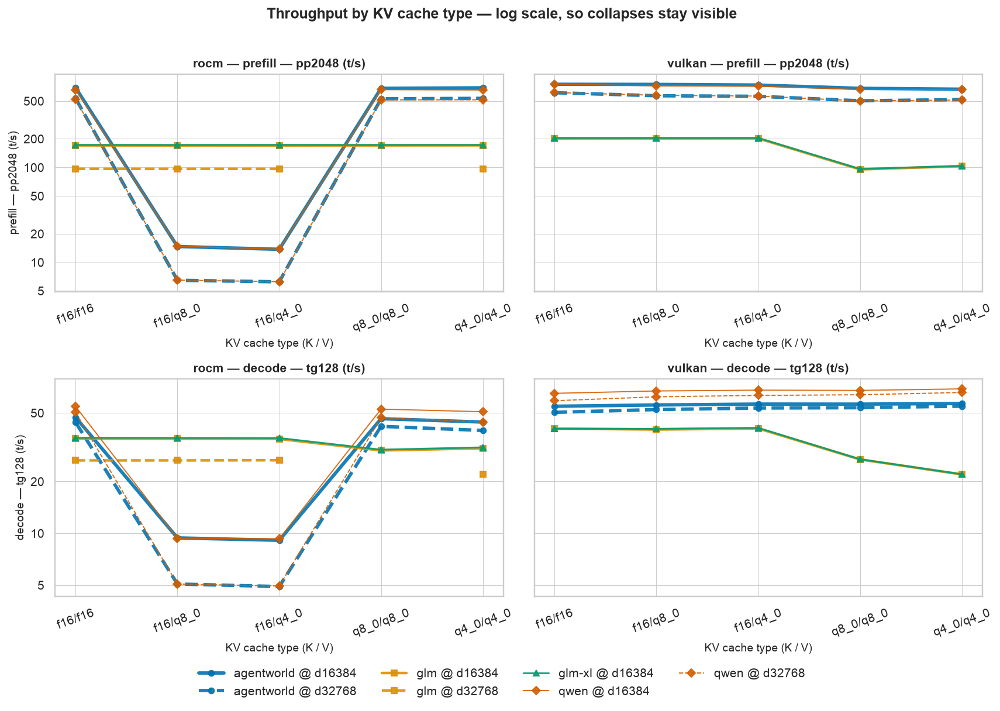
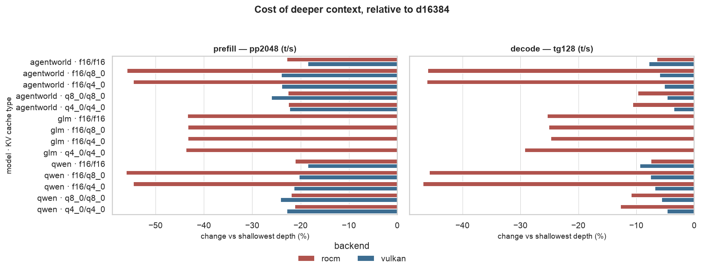

# KV cache types, ROCm and Vulkan on a gfx1151 iGPU

A study of `llama.cpp` inference throughput on an **AMD Ryzen AI MAX+ 395 w/ Radeon 8060S**
(gfx1151, 128 GB unified memory), comparing the **ROCm** and **Vulkan** backends across KV
cache quantisation types, two context depths, and four MoE models — two of them Unsloth
Dynamic (`UD`) quantisations.

I started out wanting to know which backend was faster. The data pushed me toward a more
useful question: **which KV cache configurations each backend actually handles well**, since
that choice moves throughput far more than the backend does. This write-up is a record of
what I measured and what I think it means, not a benchmark ranking — see
[Limitations](#limitations) before reusing any number here.

## Snapshot

| | |
| --- | --- |
| Hardware | AMD Ryzen AI MAX+ 395 w/ Radeon 8060S (gfx1151), 128 GB unified memory |
| Backends | ROCm (build `a66d505`), Vulkan / RADV (build `d6d899580`) |
| Tests | 128 `llama-bench` records → 64 configurations |
| Recorded | 2026-07-31 to 2026-08-01 |
| Metrics | `pp2048` (prefill), `tg128` (decode), both in tokens/second |
| Factors | model × backend × context depth (16k, 32k) × KV cache type (5 of 9 K/V pairs) |

Models under test, as reported by `llama.cpp` itself:

| label | file | arch | quant | size |
| --- | --- | --- | --- | --- |
| `qwen` | `Qwen3.6-35B-A3B-Q4_K_M.gguf` | `qwen35moe` | `Q4_K_M` | 19.70 GiB |
| `agentworld` | `Qwen-AgentWorld-35B-A3B-UD-Q4_K_XL.gguf` | `qwen35moe` | `UD-Q4_K_XL` | 20.78 GiB |
| `glm` | `GLM-4.7-Flash-Q4_K_M.gguf` | `deepseek2` | `Q4_K_M` | 17.05 GiB |
| `glm-xl` | `GLM-4.7-Flash-UD-Q4_K_XL.gguf` | `deepseek2` | `UD-Q4_K_XL` | 16.31 GiB |

## What I found

### 1. Each backend has its own KV cache cliff, and they are opposites

This is the result that reframed the study. Quantising the KV cache is not uniformly cheap or
uniformly expensive — it depends on *which* backend and *which* attention implementation, and
the two backends fail on complementary configurations.



On **ROCm**, the `qwen35moe` models fall off a cliff with **asymmetric** KV (`f16` keys, a
quantised value cache): prefill drops from ~690 t/s to ~14 t/s at 16k depth, roughly a 98 %
loss, with decode down about 80 %. Symmetric quantisation (`q8_0/q8_0`, `q4_0/q4_0`) on the
same backend is nearly free for prefill and costs 6–17 % of decode. The `deepseek2` models
are untouched by this.

On **Vulkan**, the mirror image: asymmetric KV costs a few percent at most, but the
`deepseek2` models lose about **half their prefill** and a third of decode under symmetric
quantisation.


The magnitude is what makes me read the ROCm case as a code-path problem rather than an
arithmetic one. A 50× loss is not what dequantising a smaller cache costs; it is what falling
off an optimised (likely fused flash-attention) path costs. I have not confirmed that, and
[testing it](#what-id-measure-next) is the first thing I would do next.

Practical takeaway for this machine: `f16/f16` is the only KV configuration that is safe on
both backends. If the cache has to shrink, ROCm tolerates symmetric quantisation and Vulkan
tolerates asymmetric — exactly the reverse of one another.

### 2. The backend gap is small next to the cliffs

With the KV cache held at a configuration both backends handle, Vulkan leads by roughly
**9–19 %** on both prefill and decode, consistently across all four models.


The `51×`–`90×` cells are the ROCm asymmetric-KV collapse seen from the other side, and the
`0.56×` cells are the Vulkan symmetric-KV regression on `deepseek2`. Collapsing this table
into a single "Vulkan is N× faster" number would be meaningless — the median would be
inflated by a defect in one backend and depressed by a different defect in the other. It is
also worth repeating that the two backends were built from different `llama.cpp` commits, so
this 9–19 % gap is a property of *these two builds on this machine*, not of the backends in
general.

### 3. Doubling context costs prefill far more than decode



Going from 16k to 32k depth costs about **18–24 % of prefill** but only **4–9 % of decode**
in the healthy configurations. That ordering makes sense: attention over a longer cache
dominates a batched 2048-token prefill much more than it dominates single-token decode.

Two details stood out. The collapsed ROCm configurations degrade *further* with depth — the
cliff steepens, losing another ~55 % on top of an already 50× loss. And `glm` on ROCm loses
~43 % of prefill from 16k to 32k even on `f16/f16`, a noticeably steeper depth curve than the
`qwen35moe` models show on the same backend.

### 4. The Unsloth Dynamic variants cost nothing measurable

`glm` (`Q4_K_M`) and `glm-xl` (`UD-Q4_K_XL`) are the same base model at the same parameter
count, which makes them the one pair in this study that isolates the quantisation mix. Across
all ten paired configurations the `UD` build lands within about **1 %** — and on prefill it is
faster in 10 of 10 pairs, while also being the smaller file on disk (16.31 vs 17.05 GiB).

A 1 % gap is well inside what a single repetition can resolve, so I would not claim `UD` is
faster. But a consistent *direction* across ten independent pairs is harder to write off as
noise than the magnitude alone suggests. My reading is that the dynamic quantisation is
throughput-neutral to marginally favourable here, and that the reason to choose it would be
memory footprint or output quality — neither of which this study measures.

The other `UD` model, `agentworld`, can't be used this way: it's a different fine-tune from
`qwen`, so comparing them mixes the model and the quantisation with no way to separate the
two.

## How the data is treated

Every number above is a **paired contrast**: one factor changes, every other factor is held
fixed, and the pair is only formed where both sides were actually measured. That is a
deliberate choice forced by the data — the design is not fully crossed (16 of 80 factorial
cells were never run), so an unpaired mean over the whole table would silently compare
different sets of conditions.

`data/results.jsonl` is the raw `llama-bench --output jsonl` log. It is appended to and never
edited; nothing downstream writes back to it. Column names from the log are used verbatim, so
any figure or table traces back to a field that literally exists in the source records.

An audit runs before the analysis and reports what the data can support. It verifies that the
twelve runtime knobs meant to be constant really are, that no configuration appears twice,
that every configuration has both metrics, and it raises the caveats listed below. It
distinguishes *blockers* (which would invalidate the analysis) from *caveats* (which
constrain interpretation). The current snapshot has no blockers and three caveats.

## Limitations

These are the reasons not to treat this as a benchmark.

- **One repetition per test.** `stddev_ts` is zero by construction, so run-to-run variance is
  unknown. The 50× effects would survive any plausible variance; the 9–19 % backend gap and
  the ~1 % variant difference genuinely need replication before they mean much. No percentage
  here should be read to two decimal places.
- **Backend is confounded with build version.** ROCm ran on `a66d505`, Vulkan on `d6d899580`.
  Rebuilding both from one commit is the single change that would most improve this study.
- **Throughput only.** No perplexity, no task accuracy. A KV cache quantisation that is free
  in tokens/second is not necessarily free in output quality, and nothing here speaks to that.
- **Two depths.** 16k and 32k give a slope, not a curve.
- **Partial KV grid.** 5 of the 9 K/V type pairs were measured.
- **One machine, one thermal envelope.** Runs were sequential on a laptop-class iGPU;
  sustained-load throttling is not controlled for, and run order is not randomised.

## What I'd measure next

1. Rebuild both backends from the same `llama.cpp` commit and re-run with at least three
   repetitions per test, interleaved rather than grouped by backend.
2. Fill the missing GLM cells at 32k so the design is fully crossed.
3. Isolate the ROCm asymmetric-KV cliff: does it survive with flash attention disabled? That
   would distinguish an unsupported fused-attention path from a general dequantisation cost.
4. Sweep depth (4k, 8k, 16k, 32k, 64k) to get the shape of the prefill curve rather than two
   points on it.
5. Add a quality measurement, so "KV quantisation is free" can be checked against something
   other than speed.

## Repository layout

```
data/results.jsonl        raw llama-bench output — append-only, never edited
notebooks/analysis.py     the study, as a marimo notebook
src/llmbench/             analysis helpers
  schema.py               field names, factor orderings, design constants
  loading.py              JSONL -> tidy and wide DataFrames
  validation.py           the integrity audit
  contrasts.py            paired contrasts and summaries
  plots.py                figures
scripts/render_figures.py regenerates figures/ and prints the numbers quoted above
tests/                    tests for the loading, contrast and audit logic
figures/                  generated — do not edit by hand
```

## Running it

```bash
uv sync --extra dev            # or: uv pip install -e '.[dev]'

marimo edit notebooks/analysis.py   # explore interactively
python notebooks/analysis.py        # execute headlessly, as CI does
python scripts/render_figures.py    # refresh figures/ and print the headline numbers
pytest                              # 39 tests
ruff check .
```

The notebook is a marimo notebook, which means it is a plain Python file rather than JSON:
it diffs readably in git, imports the helper modules directly, and runs as a script. Its cells
form a dependency graph rather than a linear sequence, so a cell cannot silently depend on
another one having been run first — a class of bug the earlier Jupyter version of this
analysis did have.

After appending new runs to `data/results.jsonl`, re-run `scripts/render_figures.py`: it
reprints every number quoted in this README, which makes it obvious when the write-up has
gone stale.
